# 🧹 服务器冗余空间清理 Skill

面向多人共用服务器的 Agent Skill：通过多轮对话盘点个人目录中的大文件、模型权重、数据集、checkpoint、缓存与虚拟环境，给出可审查的清理建议，并且只在用户逐项确认后执行可能破坏数据的操作。

## ✨ 特性

- **简单上手：** 用多轮对话的形式完成所有清理内容。
- **安全盘点：** 默认只读，先展示空间占用与候选项；所有删除、迁移和环境清理均须逐项确认。
- **公共去重：** 先确认模型和数据集公共目录（默认 `/publicdata/model`、`/publicdata/data`），再以版本、清单、大小和 SHA-256 校验重复内容。
- **安全迁移：** 缺失公共副本时先复制并校验；需要保留旧代码路径时，可验证后切换为指向公共副本的软链接。
- **共享保护：** 公共目录多人可写，Skill 不会自动删除、覆盖、重命名或移动其中内容；checkpoint 与未知大文件只作待审查项。

## 🚀 最快使用：复制给你的 Agent

打开 Codex、Claude Code 或其他支持 Skill 的 Agent，将下面整段话直接发送：

```text
请从 GitHub 仓库下载并安装这个 Skill：
https://github.com/lucianma05-create/Server-Space-Cleanup-Skill.git

请使用你支持的原生 Skill 安装方式；若没有安装器，再将完整仓库克隆到你自己的 Skill 目录。
不要覆盖已有同名 Skill，除非先向我确认。完成后告诉我安装位置，以及是否需要新开会话。

然后使用 server-space-cleanup 盘点我的个人服务器空间：先确认个人目录、公共模型目录和公共数据集目录；
只做只读盘点和清理建议，不要删除、移动或修改任何文件，直到我逐项确认。
```

安装完成后，Skill 会按多轮对话引导你确认目录、审查候选项，并在未获得逐项确认前保持只读。

## 🧭 实际使用流程

以下截图按一次真实清理会话的发生顺序展示。Skill 先盘点并给出候选项，再由用户分组选择，最后统一复核；不会在未确认前执行删除。

### 1. 启动 Skill 并开始只读盘点

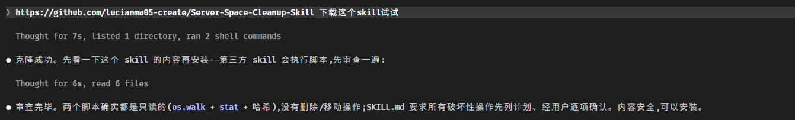

### 2. 确认本次公共模型与数据集目录

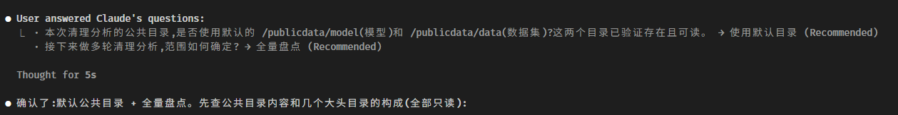

### 3. 查看模型、checkpoint 与其他候选项的盘点结果

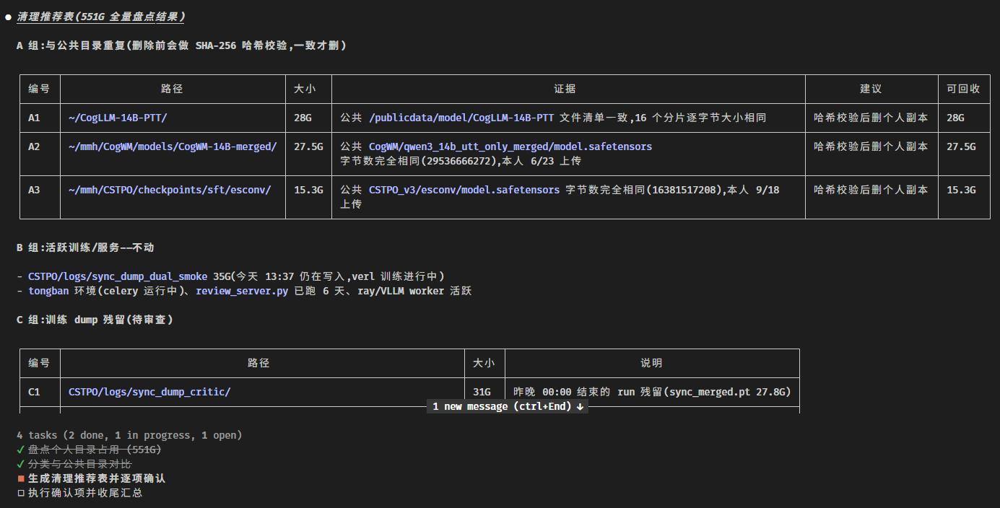

### 4. 选择与公共目录重复的模型权重处理方案

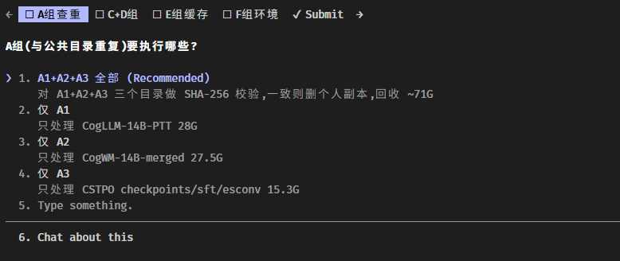

### 5. 选择训练 dump、实验中间产物与 checkpoint 的处理方案

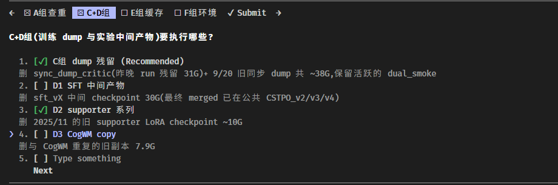

### 6. 选择可重新生成或下载的缓存处理方案

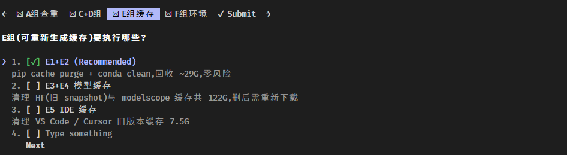

### 7. 确认不再使用的虚拟环境

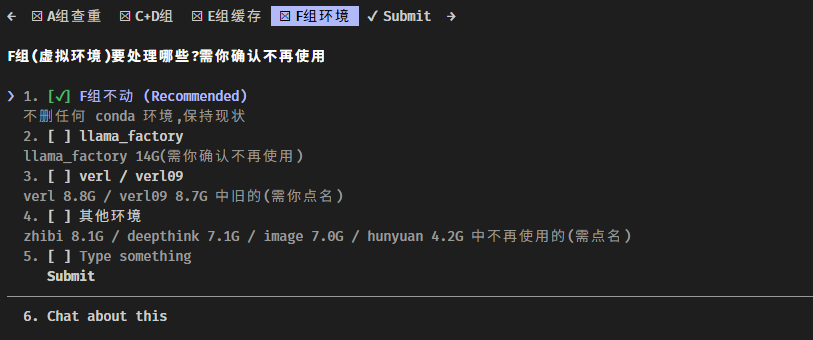

### 8. 复核所有选择后再提交

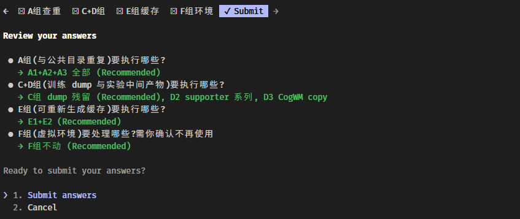

### 9. 展示即将执行的精确处理清单

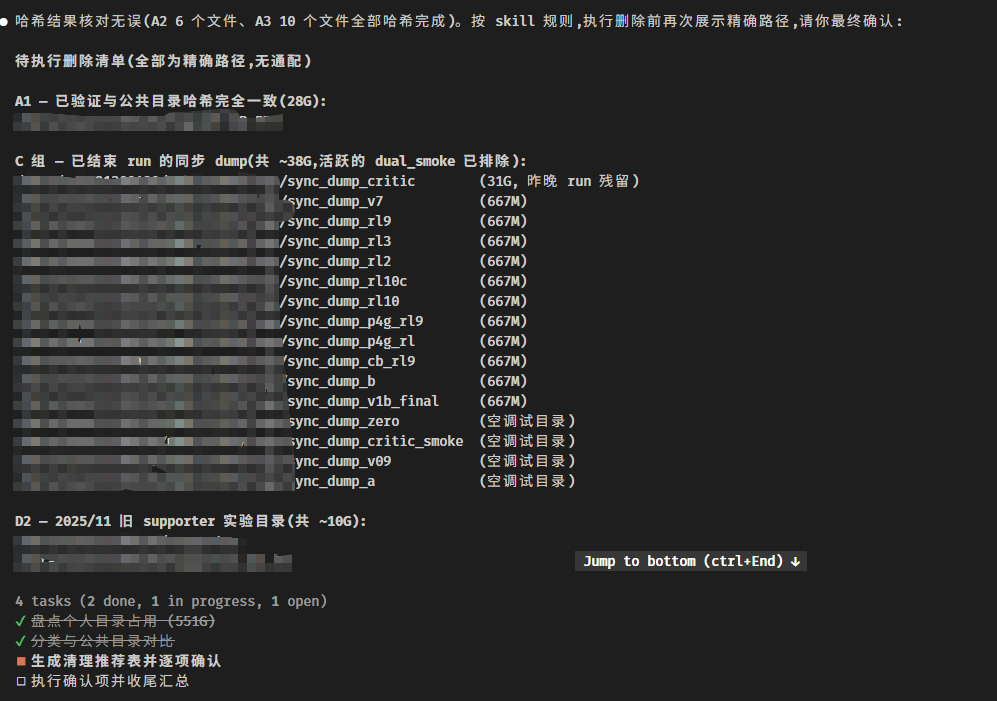

### 10. 对不可恢复操作作最终确认

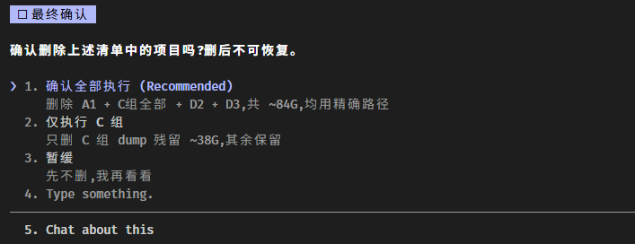

### 11. 查看执行结果、回收空间与保留项

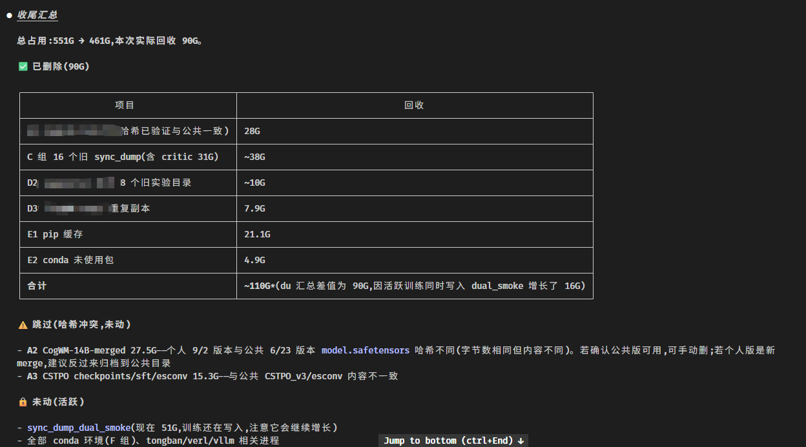

## 🛠️ 操作与工具

### 🔗 保留旧代码路径

若个人模型或数据集已验证与公共副本完全一致，但现有代码仍引用个人路径，可先完成“个人路径 → 公共副本”的软链接切换：脚本会保留带时间戳的个人备份，并在原路径建立绝对软链接。确认代码正常运行后，再单独确认删除备份以回收空间。

```bash
# 先校验内容，不修改路径
python scripts/link_to_public.py /data/$USER/models/example /publicdata/model/example --verify

# 确认无误后，执行备份与软链接切换
python scripts/link_to_public.py /data/$USER/models/example /publicdata/model/example --verify --apply
```

若本次确认的公共根目录不是 `/publicdata`，请显式传入 `--public-root`。

### 🔎 只读盘点与校验

两个脚本均为只读：

```bash
# 盘点目录，并默认列出大于等于 1 GiB 的文件
python scripts/inventory.py /data/$USER

# 调整大文件阈值与显示数量
python scripts/inventory.py /data/$USER --min-size-gib 5 --limit 100

# 为单个文件或目录生成 SHA-256 清单
python scripts/fingerprint.py /path/to/model-or-dataset
```

目录级哈希会读取全部文件，面对大型模型或数据集可能耗时较长；应仅在需要确认重复副本时使用。

## 🛡️ 安全边界

- 不检查或操作其他用户的个人目录。
- 不清理可能被活跃任务使用的文件。
- 旧文件不是可删除文件的充分依据。
- 任何证据不足的重复项都标为“未知”或“冲突”，由用户决定如何处理。
- 不使用未经审查的通配符进行删除。

详细工作流见 [SKILL.md](SKILL.md)，本服务器的公共存储规则见 [references/storage-policy.md](references/storage-policy.md)。
